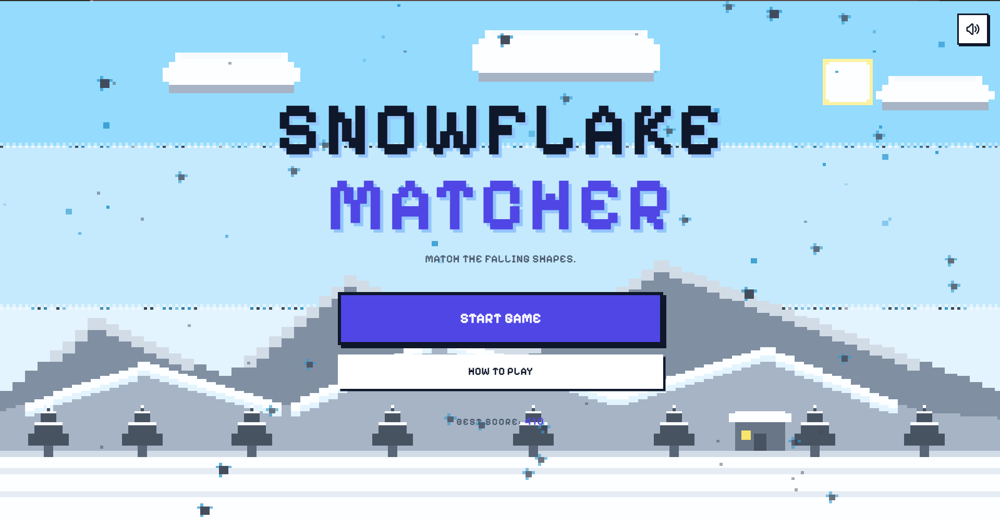
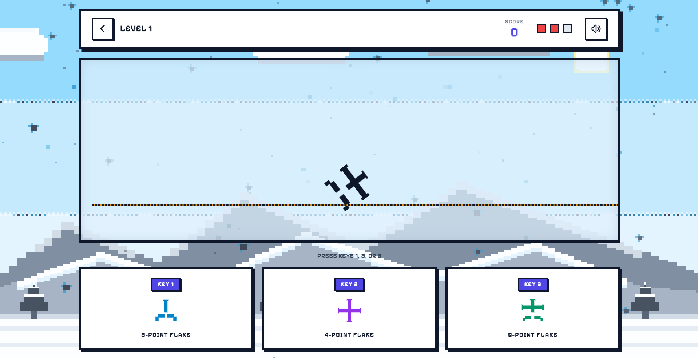

### Snowflake Matrix

Super fun cool game where falling snowflakes come down and you have to catch them fast before they touch bottom!

### Description :-
This is my super epic game about catching pretty snowflakes in a futuristic space matrix background. When snowflakes fall down on the screen you have to press keys or click buttons to match the shape like star flower or needle. If you hit right key you get big score and combo score! But if you miss you lose life and game gets super fast and crazy. I built this with HTML and typescript and vite because it makes it run fast on web browser. You can play to get high score and get cool shiny crystals!

Screenshots sample -

Here is HOMEPAGE of the game:


Here is PLAYZONE of the game:


Here is PLAY AGAIN conatiner:


### Dependencies:-

- Windows 10 or 11 or Mac computer
- Modern web browser like Chrome Edge or Firefox
- Node.js version 18 or higher installed on your computer

### Installing:-

- Download or clone this folder project from github to your computer
- No extra file modification needed just open folder in your terminal!

### Executing program:-

1.Open command prompt or terminal in project folder
2.Run this command to install all magic packages:
 ```bash
npm install
```
3.Now run this command to start the game server:
```bash
npm run dev
```
4.Open your browser and go to `http://localhost:3000` to play game!

### Help:-

If game does not load or screen stays blank try to check if node is installed properly or restart dev server. If port 3000 is busy vite will show another port in terminal so check terminal output!

you can run this command to see helper info:
```bash
npm run --help
```

## License:-

This project is licensed under the MIT License - see the LICENSE.md file for details
